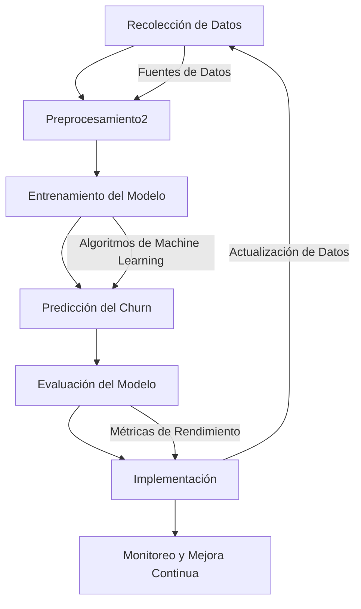

# Proyecto de Análisis de Churn

Este proyecto tiene como objetivo analizar y predecir la tasa de churn (abandono) en clientes. A continuación, se describe el flujo general del proceso de modelado.

## Diagrama de Flujo del Modelo de Churn

El siguiente diagrama muestra las principales etapas del proceso:



## Instalación

Para instalar las dependencias del proyecto, usa el siguiente comando:

```bash
pip install -r requirements.txt
```

## Uso

Para ejecutar el análisis, sigue estos pasos:

1. **Preparar los datos**: Asegúrate de que los datos estén en el formato adecuado y colócalos en la carpeta `data`.
2. **Ejecutar el script de preprocesamiento**: Corre el script `preprocess.py` para preparar los datos.
3. **Entrenar el modelo**: Usa el script `train_model.py` para entrenar el modelo.
4. **Hacer predicciones**: Ejecuta `predict.py` para hacer predicciones sobre nuevos datos.

## Contribución

Si deseas contribuir al proyecto, por favor sigue estos pasos:

1. Haz un fork del repositorio.
2. Crea una nueva rama (`git checkout -b feature/nueva-caracteristica`).
3. Realiza tus cambios y haz un commit (`git commit -am 'Agrega nueva característica'`).
4. Haz un push a la rama (`git push origin feature/nueva-caracteristica`).
5. Crea un pull request.

## Licencia

Este proyecto está licenciado bajo la Licencia MIT. Consulta el archivo [LICENSE](LICENSE) para más detalles.
